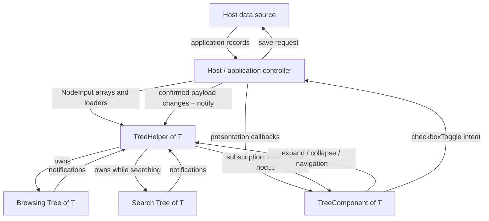
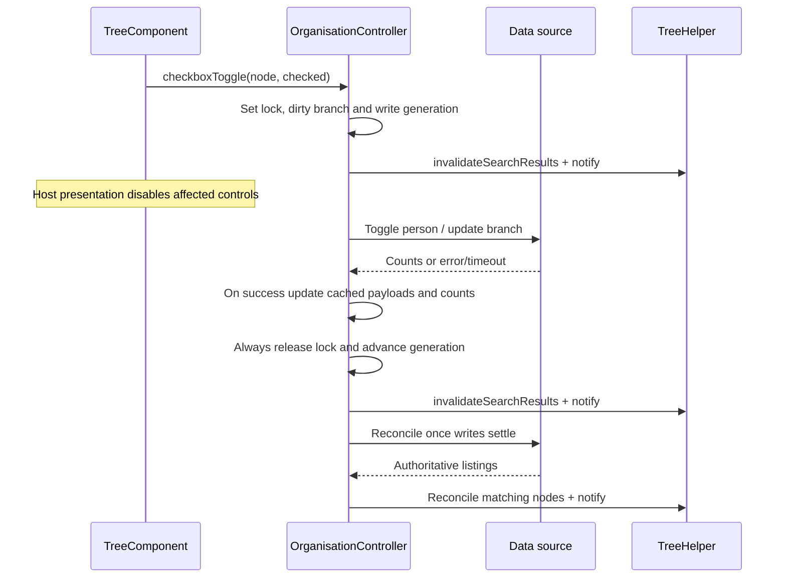

# Developer guide: how the tree works

This guide describes the current `feature/copy-paste-tree` implementation. Start with the flow overview, then use the member tables as a reference while reading the code. [README.md](README.md) contains setup commands and a small integration example.

**Maintenance rule:** whenever a later change affects files, public APIs, state ownership, data flow or behavior described here, update this guide in the same change. Update examples and diagrams too. Describe implemented behavior, and explicitly label any proposal that has not been implemented.

## 1. Read this first

There are three responsibilities:

1. **Host application:** decides what data means, fetches it, handles saves, groups search results and supplies display rules.
2. **Generic tree helper:** stores nodes and their relationships, loads children through supplied callbacks, traverses visible nodes and switches between browsing and search trees.
3. **Angular tree component:** renders the current tree, manages keyboard/focus interactions and emits checkbox intent back to the host.

The generic tree never inspects payload fields. `T` can be a string, a file record, a category or an application-specific union. There are no required domain IDs or fixed hierarchy levels.

**Naming detail in this demo:** `DemoComponent.helper` is an `OrganisationController`. Its own `.helper` is the generic `TreeHelper<OrganisationNode>`. Therefore `[helper]="helper.helper"` passes the generic helper into the renderer. These are two different objects, despite sharing the property name.

## 2. File map and reading order

| File                                                                 | Responsibility and reason for existing                                                                                                                                       |
| -------------------------------------------------------------------- | ---------------------------------------------------------------------------------------------------------------------------------------------------------------------------- |
| [tree.model.ts](src/app/tree/tree.model.ts)                          | Generic contracts shared by the helper, renderer and host. Start here.                                                                                                       |
| [tree.helper.ts](src/app/tree/tree.helper.ts)                        | Plain TypeScript `Tree<T>` and `TreeHelper<T>`. Structural operations stay independent of Angular.                                                                           |
| [tree.component.ts](src/app/tree/tree.component.ts)                  | Angular bindings, subscriptions, checkbox events and focus. DOM references stay here.                                                                                        |
| [tree.component.html](src/app/tree/tree.component.html)              | Flat list of visible rows with tree semantics, indentation, carets, optional checkboxes/descriptions and node errors/retry.                                                  |
| [tree.component.scss](src/app/tree/tree.component.scss)              | Local row layout, focus styles and checkbox appearance.                                                                                                                      |
| [demo.component.ts](src/app/demo/demo.component.ts)                  | Application types, `OrganisationController`, `DemoDataSource` and `DemoComponent`. Domain logic lives here to keep the five copied files generic and the demo project small. |
| [demo.component.html](src/app/demo/demo.component.html)              | Heading, external search, page-level statuses/errors, tree bindings and empty-result message.                                                                                |
| [demo.component.scss](src/app/demo/demo.component.scss)              | Page and search layout, separate from reusable row styling.                                                                                                                  |
| [main.ts](src/main.ts)                                               | Bootstraps the standalone demo component.                                                                                                                                    |
| [index.html](src/index.html)                                         | Browser document and root element.                                                                                                                                           |
| [angular.json](angular.json)                                         | One application's build/serve configuration, entry points, Zone.js and output directory.                                                                                     |
| [tsconfig.json](tsconfig.json)                                       | Strict TypeScript/template checking and compilation entry point.                                                                                                             |
| [package.json](package.json), [package-lock.json](package-lock.json) | Start/build commands and pinned dependencies. The project is private.                                                                                                        |
| [.nvmrc](.nvmrc), [.gitignore](.gitignore)                           | Demo Node version and exclusions for generated/dependency files.                                                                                                             |

## 3. Models: input descriptions versus live nodes

`NodeInput<T>` describes a node you want the tree to create. `TreeNode<T>` is the live object created and indexed by `Tree<T>`. Pass inputs into insertion methods; do not construct or splice live nodes yourself.

| Model/member                            | Meaning and purpose                                                                                                                                                                                                          |
| --------------------------------------- | ---------------------------------------------------------------------------------------------------------------------------------------------------------------------------------------------------------------------------- |
| `NodeInput.data`                        | Host payload. The tree keeps the reference; it does not deep-clone or interpret it.                                                                                                                                          |
| `NodeInput.children`                    | Optional already-known child inputs. Supplying even `[]` means this node is loaded.                                                                                                                                          |
| `NodeInput.loader` / `Loader<T>`        | Optional async `(node, signal) => NodeInput<T>[]`. The host supplies transport and mapping; the tree owns insertion.                                                                                                         |
| `NodeInput.hasChildren`                 | Optional disclosure hint before children are loaded. Loaded child arrays determine the actual value.                                                                                                                         |
| `NodeInput.expanded`                    | Initial expansion, default `false`.                                                                                                                                                                                          |
| `TreeNode.id`                           | Helper-generated identity used for lookup and Angular tracking; separate from any payload ID.                                                                                                                                |
| `TreeNode.data`                         | Current payload. Hosts can replace it while retaining the node object and ID.                                                                                                                                                |
| `TreeNode.parent`, `index`              | Parent and position among siblings; enable navigation without DOM searching.                                                                                                                                                 |
| `TreeNode.children`                     | Owned child array. `readonly` prevents reassigning the property, not array mutation; use tree methods to maintain indexes.                                                                                                   |
| `TreeNode.hasChildren`, `expanded`      | Whether to show a disclosure and whether loaded descendants are visible.                                                                                                                                                     |
| `TreeNode.isLoaded`, `loading`, `error` | Successful-load cache, pending indicator and last load failure message. They are separate: a failed node remains retryable.                                                                                                  |
| `TreeNode.loader`                       | Stored callback, or `null` for a node without lazy loading.                                                                                                                                                                  |
| `CheckState`                            | `unchecked`, `mixed` or `checked`; no automatic parent selection policy is implied.                                                                                                                                          |
| `TreeCheckbox`                          | Presentation descriptor: `state`, optional `disabled`, optional accessible `label`.                                                                                                                                          |
| `TreePresentation<T>`                   | Required `label(node)` plus optional `checkbox(node)` and `description(node)`. Return `null` to omit a checkbox or description. Keep these callbacks cheap and free of side effects: templates may evaluate them repeatedly. |
| `CheckboxToggle<T>`                     | `{ node, checked }` emitted to the host. Mixed/unchecked requests `true`; checked requests `false`.                                                                                                                          |
| `SearchRequestToken`                    | Frozen helper-issued object carrying a `revision`. Pass the original object back, not a copy.                                                                                                                                |
| `SearchApplyResult`                     | `applied`, `superseded` or `data-changed`, allowing the host to decide what to do next.                                                                                                                                      |

## 4. `Tree<T>`: one structural tree

The invisible `root` is always expanded and loaded. Its children are the displayed top-level nodes. It makes navigation between separate top-level entries work just like sibling navigation anywhere else. Its `data` is an internal placeholder: never present it to a payload callback.

| Members                                        | What they do and why                                                                                                                                                                     |
| ---------------------------------------------- | ---------------------------------------------------------------------------------------------------------------------------------------------------------------------------------------- |
| Module `nextTree`; instance `serial`, `prefix` | Generate different IDs across tree instances and nodes.                                                                                                                                  |
| `root`, `roots`                                | Internal sentinel and read-only view of its displayed children.                                                                                                                          |
| `nodes`, `get(id)`                             | Map live IDs to nodes for lookup and ownership checks.                                                                                                                                   |
| `listeners`, `subscribe()`, `notify()`         | Synchronous change notifications. `subscribe` returns an unsubscribe function. No Angular dependency is needed.                                                                          |
| `pending`                                      | Map each loading node to its abort controller and shared promise, preventing duplicate loads.                                                                                            |
| `disposed`, `dispose()`                        | Mark inactive, abort pending work and clear lookup/subscriber maps. Dispose at the owning host's end of life.                                                                            |
| `assertNode()`                                 | Reject structural operations on nodes from another tree or a disposed tree.                                                                                                              |
| `insertNodesAtRoot()`                          | Convenience wrapper around child insertion on the invisible root.                                                                                                                        |
| `insertChildrenForNode()`                      | Insert at an optional sibling index, repair indexes, mark parent loaded and notify.                                                                                                      |
| `create()`                                     | Private recursive construction: generate IDs, link parents, apply defaults and register descendants.                                                                                     |
| `replaceChildren()`                            | Remove existing descendants and cancel obsolete loads, then create replacements. This intentionally creates new node identities.                                                         |
| `reconcileChildren(parent, inputs, key)`       | Match siblings by a host key, update matching payloads and preserve their IDs/expansion; create missing entries, remove absent ones and follow input order. Reject duplicate input keys. |
| `remove()`                                     | Private recursive removal from maps, including cancellation of descendant loads.                                                                                                         |
| `expand()`, `collapse()`                       | Change visibility and notify. Expansion also calls `load`; collapse retains children and does not cancel loading.                                                                        |
| `load()`                                       | Deduplicate pending work, skip successful cached loads, run the supplied loader, insert accepted results and record failures. A later call retries a failed load.                        |
| `nextVisibleNode()`                            | First visible child; otherwise next sibling, walking upward as necessary. Returns `null` at the end.                                                                                     |
| `previousVisibleNode()`                        | Previous sibling's deepest visible descendant, or parent; excludes the sentinel.                                                                                                         |
| `visibleNodes()`                               | Flatten visible nodes in display order for the renderer. Collapsed descendants remain stored but are omitted.                                                                            |

`reconcileChildren` reconciles **one sibling listing**. It does not recursively merge `input.children` into already-matching nodes, nor reset their expansion. Reconcile each loaded level separately, as the demo does. To deliberately rebuild descendants, use `replaceChildren`.

Load cancellation prevents obsolete results from being inserted even when a transport ignores `AbortSignal`. It does not guarantee that an external HTTP request was physically cancelled. The generic helper imposes no network timeout; loaders own that policy.

## 5. `TreeHelper<T>`: browsing and temporary search

| Members                                 | What they do and why                                                                                                                                                 |
| --------------------------------------- | -------------------------------------------------------------------------------------------------------------------------------------------------------------------- |
| `browsing`                              | Persistent structural tree containing cached browsing nodes and expansion.                                                                                           |
| `searchTree`                            | Temporary tree, `null` outside search. An empty search result is still search mode. Treat it as helper-managed state.                                                |
| `isSearchMode`, `tree`                  | Derived mode and currently displayed tree. The renderer always reads `tree`.                                                                                         |
| Constructor                             | Forwards browsing notifications to helper subscribers. Search trees get the same forwarding when created.                                                            |
| `listeners`, `subscribe()`, `notify()`  | One subscription surface across mode switches and host presentation updates. `notify()` does not invalidate search snapshots.                                        |
| `expand(node)`                          | Delegate expansion to the currently displayed tree. Use nodes from that tree.                                                                                        |
| `revision`, `invalidateSearchResults()` | Host-controlled data version. Increment when application changes make an outstanding search snapshot unsafe. This does not notify or fetch anything.                 |
| `activeSearch`, `beginSearch()`         | Dispose previous search results, create an empty temporary tree and issue a new token. Browsing stays intact.                                                        |
| `applySearchResults(inputs, token)`     | Validate token/revision and install the host-built hierarchy. Recursively force all result nodes expanded, loaded and without loaders. Consume accepted tokens once. |
| `restoreBrowsing()`                     | Invalidate the token, dispose search nodes and immediately expose cached browsing. Synchronous; no API calls.                                                        |
| `disposed`, `dispose()`                 | Reject later search application, dispose both trees and clear listeners. `beginSearch()` after disposal throws.                                                      |

`superseded` means the token is old, already used, foreign, or the helper is disposed/outside search. `data-changed` means the current request's revision no longer matches. The host may start a new search request; the helper never retries requests itself.

## 6. `TreeComponent<T>`: rendering and user intent

| Members                                           | What they do and why                                                                                                                                           |
| ------------------------------------------------- | -------------------------------------------------------------------------------------------------------------------------------------------------------------- |
| Inputs `helper`, `label`, `presentation`          | Host-owned state, accessible tree label (default `Tree`), and payload display rules (default `String(node.data)`).                                             |
| Output `checkboxToggle`                           | Send checkbox intent outward without changing payload or calling a backend.                                                                                    |
| `rows`, `trackNode()`                             | Current visible nodes, tracked by helper ID to preserve DOM elements across updates.                                                                           |
| `activeId`                                        | Row carrying the single roving `tabindex="0"`; other rows use `-1`.                                                                                            |
| `rowElements`                                     | Angular query of rendered row elements, used only for focus.                                                                                                   |
| `unsubscribe`, `ngOnChanges()`                    | Detach the old subscription and subscribe to the supplied helper; clear rows for a null helper.                                                                |
| `changeDetector`, `zone`                          | Run subscription updates in Angular's zone and explicitly mark OnPush views for checking, including supported zoneless hosts.                                  |
| `updateRows()`                                    | Recompute visible rows, preserve active ID if possible, otherwise choose a visible ancestor or first row; schedule focus restoration only if a row held focus. |
| `level()`                                         | Count parents for indentation and `aria-level`.                                                                                                                |
| `focus()`, `pendingFocus`, `ngAfterViewChecked()` | Focus an existing row immediately, or wait until Angular renders it.                                                                                           |
| `toggleCheckbox()`                                | Cancel native click toggling, stop propagation, focus the row and call `requestToggle`.                                                                        |
| `requestToggle()`                                 | Check host presentation for an eligible checkbox and emit the intended checked value.                                                                          |
| `toggleExpansion()`, `retryLoad()`                | Focus the row and invoke generic collapse/expand/load behavior.                                                                                                |
| `onKeydown()`                                     | Up/Down traverse; Left collapses or moves to parent; Right expands or moves to first child; Home/End choose endpoints; Space requests a checkbox change.       |
| `ngOnDestroy()`                                   | Unsubscribe only. The component does not dispose its host-owned helper.                                                                                        |

The HTML renders a flat list with `tree`/`treeitem` roles, hierarchy metadata, expansion/busy attributes and node-level retry messages. Search controls and global messages are in the host template. `.count` is just a CSS class for generic secondary text; the component does no count calculation.

Styles retain native checkbox semantics while drawing checked/mixed states in `rgb(50, 150, 70)`. Disabled controls use opacity `0.5`; forced-colors mode restores native appearance. Disclosure text stays `>` or `v` while loading. CSS variables control text, border, background, hover and focus accent.

## 7. Walk through the main flows

### Initial load and expansion

1. `main.ts` bootstraps `DemoComponent`; its constructor-time fields create the source and controller.
2. `ngOnInit()` subscribes to controller changes and calls `initialize()`.
3. The controller fetches chains and maps each record to a `NodeInput<OrganisationNode>` containing a branch loader.
4. `browsing.insertNodesAtRoot()` creates live nodes and notifies. `TreeHelper` forwards the event; the component updates `rows` and marks for checking.
5. Clicking a caret calls the **generic** `TreeHelper.expand()`, then `Tree.expand()` and `Tree.load()`.
6. The stored host callback fetches/maps children. The tree inserts accepted results and notifies again. Branch callbacks use the same process to load people.

The component does not call `OrganisationController.expand()`. That method is an additional application-facing wrapper for programmatic expansion and post-expansion indexing/dirty refresh.

### Checkbox click and confirmed save

The generic event includes `checked`. This particular demo passes only `$event.node` to `toggle()` and derives the action from current membership state. Other hosts may use `checked` directly. Parent checkboxes are related to children only because the demo controller implements that relationship.

### External search and clearing

1. `DemoComponent.onSearch()` records text, advances the host query generation and cancels its debounce timer. Clearing restores browsing immediately.
2. For nonempty text, wait 300 ms, then `loadSearchResults()` obtains a helper token through the controller and calls the source directly.
3. The host rejects callbacks if its query generation changed or it was disposed. This also protects the debounce interval before a new helper token exists.
4. The controller groups flat `{ chain, branch, person }` rows into `NodeInput` hierarchy using maps, preserving first-seen backend order and deduplicating people.
5. The generic helper validates and installs the hierarchy. On `data-changed`, the host fetches again with a new token.
6. The host owns result capping, errors, retry and loading state. Reaching 300 displays a limit warning; it does not prove the backend omitted more matches.
7. Clearing calls the controller's async `restoreBrowsing()`: the generic helper restores cached nodes synchronously, then the controller reconciles dirty membership if necessary. These two restore methods have different responsibilities and return types.

## 8. Demo-only types and controller reference

All entries in this section live in `demo.component.ts`; none are requirements of the reusable tree.

| Type/function                           | Purpose                                                                                                                               |
| --------------------------------------- | ------------------------------------------------------------------------------------------------------------------------------------- |
| `Id`, `ChainIdentity`, `BranchIdentity` | String domain IDs and labels; branches also identify their chain.                                                                     |
| `Counts`, `Chain`, `Branch`             | Full membership/total counts, even when descendants have not loaded.                                                                  |
| `Person`, `personKey()`                 | Person membership plus branch/employee identity. JSON-encoded pairs avoid collisions and allow repeated employee IDs across branches. |
| `OrganisationNode`                      | Demo payload union distinguishing chain, branch and person. Ancestor search records may omit counts.                                  |
| `SearchRow`                             | Flat backend search record used only by host grouping.                                                                                |
| `MutationResult`, `BranchAction`        | Updated chain/branch counts and `addAll`, `addRemaining`, `removeAll` actions.                                                        |
| `OrganisationDataSource`                | Five listing/mutation methods taking project context. Search is deliberately absent from this required interface.                     |
| `PickerOptions`                         | Controller request timeout configuration.                                                                                             |
| `checkState()`                          | Empty/zero members → unchecked; full membership → checked; otherwise mixed.                                                           |

### `OrganisationController` state

| Members                                                            | Purpose                                                                                                                  |
| ------------------------------------------------------------------ | ------------------------------------------------------------------------------------------------------------------------ |
| `source`, `projectId`, `timeoutMs`                                 | Application backend/context and request deadline, default 10 seconds.                                                    |
| `helper`; getters `browsing`, `searchTree`, `tree`, `isSearchMode` | Own generic helper and expose its current trees/mode.                                                                    |
| `presentation`                                                     | Supply labels, membership checkbox policy and counts. Hide ancestor checkboxes/counts during search.                     |
| `initialLoading`, `refreshing`, `error`                            | Page-level status rendered by the demo.                                                                                  |
| `chains`, `branches`                                               | Indexed browsing nodes used for count updates/reconciliation.                                                            |
| `persons`                                                          | Compound identity → set of cached node representations across browsing and search.                                       |
| `branchWrites`, `personWrites`, getter `pending`                   | Locks for active writes. Distinct people may save concurrently; branch-wide writes exclude person writes in that branch. |
| `dirty`                                                            | Affected branch → chain mappings requiring authoritative refresh.                                                        |
| `generation`                                                       | Increment at mutation start/end so reads crossing a write are rejected/repeated.                                         |
| `reconcileGeneration`                                              | Distinguish overlapping refreshes so an older refresh cannot overwrite a newer one.                                      |
| `listeners`, `disposed`                                            | Controller subscribers and lifecycle guard.                                                                              |

### `OrganisationController` methods

| Members                              | Purpose and reason                                                                                                                                                                                                                            |
| ------------------------------------ | --------------------------------------------------------------------------------------------------------------------------------------------------------------------------------------------------------------------------------------------- |
| Constructor, `subscribe()`, `emit()` | Forward generic notifications to host listeners; domain updates also notify the renderer.                                                                                                                                                     |
| `request()`                          | Apply a timeout and clear its timer afterward. Timing out does not cancel or retry a backend mutation.                                                                                                                                        |
| `stableRead()`                       | Repeat a listing read if a mutation generation changed during it.                                                                                                                                                                             |
| `failure()`                          | Normalize unknown failures to a page-level error string.                                                                                                                                                                                      |
| `initialize()`                       | Load initial chains once; guard duplicate initialization and disposal.                                                                                                                                                                        |
| `chainInput()`, `branchInput()`      | Map backend rows to payloads and lazy callbacks. Chains retain disclosure until loaded because zero people does not imply zero branches.                                                                                                      |
| `index()`                            | Rebuild branch/person caches from existing browsing/search representations.                                                                                                                                                                   |
| `expand()`                           | Programmatic domain wrapper around expansion; reindex and refresh dirty data when idle.                                                                                                                                                       |
| `disabled()`, `state()`              | Enforce chain/empty-branch/lock policies and derive checkbox presentation from authoritative counts or person membership.                                                                                                                     |
| `toggle()`                           | Guard eligible actions, lock, issue one mutation, update only on success, release in `finally` and reconcile when writes settle.                                                                                                              |
| `updateCounts()`                     | Apply returned counts to cached browsing ancestors. Overlapping responses may be provisional.                                                                                                                                                 |
| `refresh(clearError = true)`         | Read chains, affected branch listings and people; apply only across a write-free interval and for the newest refresh. Reconcile loaded levels without replacing matching nodes. Automatic recovery uses `false` to retain the original error. |
| `beginSearch()`                      | Delegate token creation to the generic helper.                                                                                                                                                                                                |
| `applySearchResults()`               | Group flat domain rows using chain/branch maps and person keys, then delegate generic reconstruction. Reindex accepted results.                                                                                                               |
| `restoreBrowsing()`                  | Restore generic browsing and reconcile dirty membership.                                                                                                                                                                                      |
| `dispose()`                          | Guard callbacks, dispose the owned helper and clear subscribers.                                                                                                                                                                              |

Backend expectations: branch IDs are unique within the organisation; search rows have consistent parent relationships and stable ordering. Counts describe whole groups, not search subsets. Without server revisions or mutation-status guarantees, a timed-out write can commit after reconciliation; a later refresh may still be needed.

## 9. Host component and mock reference

### `DemoComponent`

| Members                                                  | Purpose                                                                                                   |
| -------------------------------------------------------- | --------------------------------------------------------------------------------------------------------- |
| `dataSource`, `projectId`, `helper`                      | Mock instance, sample project context and owned `OrganisationController`.                                 |
| `maxResults`, `timeoutMs`                                | Host search cap of 300 and 10-second deadline (also supplied to the controller).                          |
| `searchText`, `searching`, `searchError`, `limitReached` | Search UI state, separate from tree state.                                                                |
| `searchGeneration`, `searchTimer`                        | Ignore old query responses and implement the 300 ms debounce.                                             |
| `unsubscribe`, `disposed`                                | Release the host subscription and ignore post-destruction callbacks.                                      |
| Constructor `changeDetector`, `zone`; `markForCheck()`   | Explicitly schedule host rendering after asynchronous work.                                               |
| `ngOnInit()`                                             | Subscribe and initialize the controller.                                                                  |
| `onSearch()`                                             | Process input changes, cancel old debounce, clear search status and restore browsing or schedule a query. |
| `fetchSearchRows()`                                      | Direct search API call wrapped in a timeout.                                                              |
| `loadSearchResults()`                                    | Coordinate query generation, helper tokens, capped results and refetch on data invalidation.              |
| `refresh()`                                              | Retry/refresh the current search, or initialize/refresh browsing.                                         |
| `ngOnDestroy()`                                          | Invalidate queries, clear timer, unsubscribe and dispose controller/helper.                               |

### `DemoDataSource`

| Members                                              | Purpose                                                                                                 |
| ---------------------------------------------------- | ------------------------------------------------------------------------------------------------------- |
| `chains`, `branches`, `persons`                      | Small in-memory organisation; repeated employee IDs across branches demonstrate compound identity.      |
| `counts()`, `chainRows()`, `branchRows()`            | Derive full current aggregate listings.                                                                 |
| `respond()`                                          | JSON-copy the response before a 150 ms delay, simulating an asynchronous snapshot.                      |
| `getChains()`, `getBranches()`, `getBranchPersons()` | Mock the three browsing endpoints.                                                                      |
| `searchPersons()`                                    | Filter person labels case-insensitively, preserve chain/branch ordering and slice to the requested cap. |
| `mutationResult()`                                   | Build current ancestor counts after a write.                                                            |
| `togglePersonMembership()`                           | Flip one compound-identified person and return counts.                                                  |
| `updateBranchMembership()`                           | Set branch people selected unless action is `removeAll`, then return counts.                            |

The mock accepts but does not partition storage by `projectId`. It is sample transport, not production persistence.

## 10. Where to change things later

| Desired change                          | Start here                                                                                         |
| --------------------------------------- | -------------------------------------------------------------------------------------------------- |
| New payload/hierarchy/backend           | Host models, input mapping, loaders and presentation; keep the five tree files domain-independent. |
| New checkbox business rule              | Host checkbox descriptor and event handler.                                                        |
| Search UI/debounce/grouping/limits      | Host component/controller. Generic helper accepts already-built hierarchies.                       |
| Node identity, loading cache, traversal | `Tree<T>`; preserve parent/index and stale-response rules.                                         |
| Search switching/token semantics        | `TreeHelper<T>` and host token handling.                                                           |
| Keyboard/focus/row rendering            | `TreeComponent<T>` and its HTML.                                                                   |
| Checkbox/caret/row appearance           | Tree SCSS/HTML; page styles remain in demo SCSS.                                                   |

After a behavior change, update the matching section of this guide and the quick-start README example. Documentation-only edits need link/content checks; implementation changes need relevant regression checks. Test tooling currently runs outside this minimal branch; the earlier validation covered unit behavior, browser interaction and isolated Angular 15–22 consumers. Do not treat past results as validation of future code changes.
